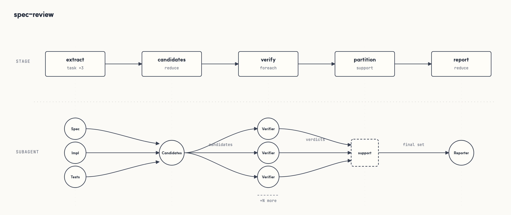
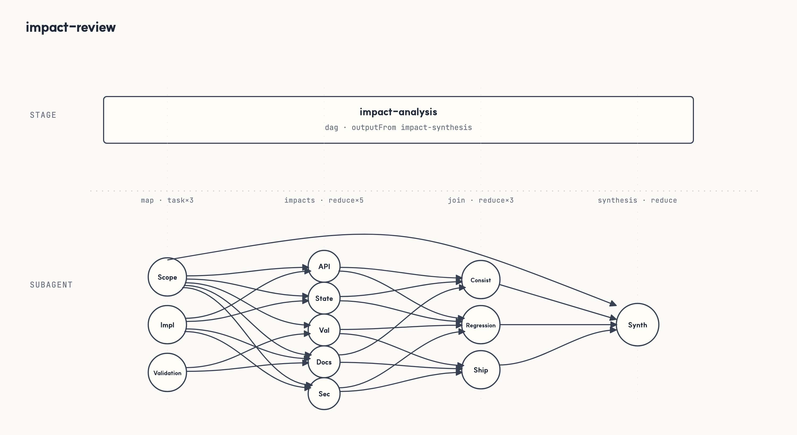
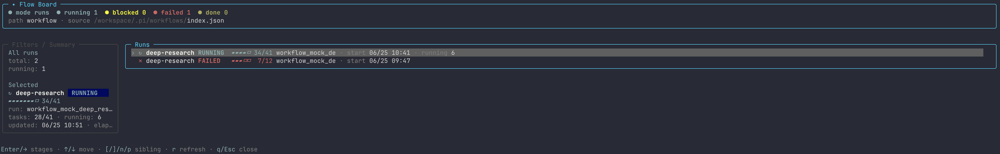
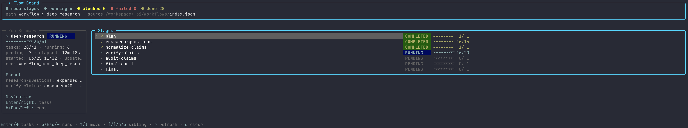
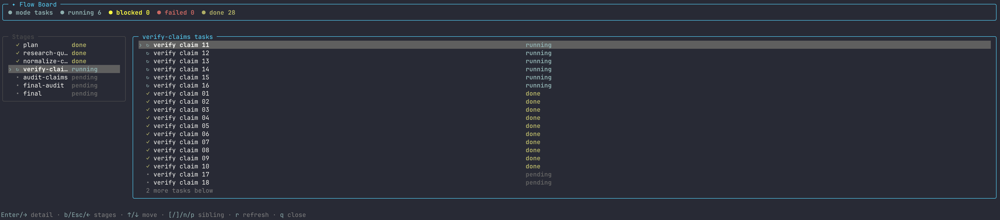
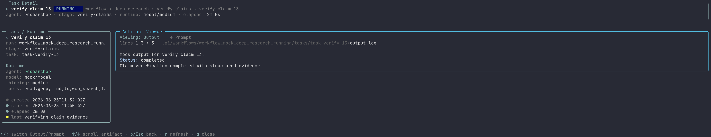

<p align="center">
  
</p>

<h1 align="center">pi-workflow</h1>

<p align="center"><strong>Workflow orchestration for Pi.</strong></p>

<p align="center">
  <a href="https://www.npmjs.com/package/@agwab/pi-workflow"></a>
</p>

`pi-workflow` lets Pi run named, repeatable multi-step workflows: research, code review, spec conformance checks, impact review, and project-specific team routines.

You choose a workflow and describe the task in natural language. `pi-workflow` coordinates the steps, passes results between them, and records the run so it can be inspected or resumed.

## Installation

Install the package:

```bash
pi install npm:@agwab/pi-workflow
```

Then reload Pi.

This installs:

- the `/workflow` extension
- the bundled `workflow-guide` skill
- the bundled `execution-router` skill

To update later:

```bash
pi update npm:@agwab/pi-workflow
```

Requires Node.js `>=22.19.0` on macOS or Linux. Native Windows is not supported; use WSL2.

## Usage: ask naturally

After installation, ask Pi to use a bundled or project workflow by name and describe the task you want handled. If you are not sure which workflow to use, ask Pi to list or choose from the available workflows.

Bundled workflows use local-first agent lookup and fall back to pi-workflow's bundled common agents such as `scout` and `researcher`. Tool-level invocation details live in [`docs/usage.md`](./docs/usage.md).

```text
Use the bundled deep-research workflow to research this repository and summarize the architecture tradeoffs.
```

```text
Use the deep-review workflow to review the current diff from multiple perspectives.
```

```text
Use the spec-review workflow to compare docs/API_SPEC.md against the implementation and tests.
```

If you want deterministic manual control, use the slash command form:

```text
/workflow run deep-research "Research this repository and summarize the architecture tradeoffs."
```

For a one-off adaptive workflow that should plan, fan out, and synthesize without choosing a saved workflow, use:

```text
/workflow dynamic "Research this repository and summarize the architecture tradeoffs."
```

`/workflow dynamic` uses pi-workflow's built-in trusted dynamic controller and records a normal workflow run under `.pi/workflows/`. Use it when you explicitly want adaptive orchestration rather than a named reusable workflow.

## Usage: choose an execution mode

Use the bundled `execution-router` skill when you are not sure whether a task should be handled directly, by a targeted verifier/subagent, by an existing workflow, or by a new workflow:

```text
/skill:execution-router decide whether this repository review should use a single-agent pass, deep-review, or a targeted verifier.
```

## Usage: create your own workflows

Use the bundled `workflow-guide` skill when you want to create, adapt, or review a workflow definition. It includes validated scaffold bundles for common graph shapes, so new workflows can start from a known-good structure before customization and validation:

```text
/skill:workflow-guide create a workflow for weekly release readiness.
It should inspect docs, tests, recent changes, package metadata, and produce a final checklist.
Save it as a reusable project workflow.
```

```text
/skill:workflow-guide customize deep-review for frontend accessibility and UX review.
Save it as a reusable project workflow.
```

```text
/skill:workflow-guide create a backend API review workflow.
It should check concurrency, transaction safety, error handling, observability, and test risk.
```

## Workflow architecture

A workflow is a deterministic stage graph for running one natural-language task through a reusable process.

`pi-workflow` is organized around three parts:

1. **Workflow** — the graph and run lifecycle: what stages exist, when they run, and how outputs move forward.
2. **Task** — agent-backed work: focused prompts, dynamic fan-out, fan-in synthesis, and bounded loops.
3. **Support** — deterministic local rails: helper code, validation, normalization, artifacts, and resume-friendly run state.

In short: workflows define the process, tasks ask Pi agents to do the work, and support keeps the process structured and repeatable.

A small workflow definition looks like this:

```json
{
  "schemaVersion": 1,
  "defaults": {
    "agent": "researcher",
    "readOnly": true,
    "tools": ["read", "grep", "find", "ls"]
  },
  "artifactGraph": {
    "stages": [
      {
        "id": "plan",
        "type": "single",
        "prompt": "Put machine-readable JSON in <control> with an items array."
      },
      {
        "id": "inspect",
        "type": "foreach",
        "from": { "source": "plan", "path": "$.items" },
        "each": { "prompt": "Inspect this item: ${item}" }
      },
      {
        "id": "prepare",
        "from": "inspect",
        "sourcePolicy": "partial",
        "support": { "uses": "./helpers/prepare.mjs" }
      },
      {
        "id": "report",
        "type": "reduce",
        "from": ["plan", "prepare"],
        "prompt": "Use upstream workflow artifacts to write the final report."
      }
    ]
  }
}
```

## Supported stage patterns

Workflow definitions compose a small set of stage patterns and graph shapes.

| Pattern | Use it for | Runtime shape |
|---|---|---|
| `single` | One focused step | one prompt -> one subagent |
| `foreach` | Dynamic fan-out | JSON array from an upstream control artifact -> one subagent per item |
| `reduce` | Fan-in / synthesis | upstream workflow artifacts -> one synthesis subagent |
| `loop` | Bounded repetition | repeat child stages until a deterministic stop condition |
| `dag` | Nested graph container | child stages lowered to namespaced tasks; selected output exposed downstream |
| `dynamic` | Adaptive orchestration | trusted bundle-local controller code can create official workflow tasks with `ctx.agent()` |


Parallel execution is a graph shape, not a stage type: model parallel branches as multiple roots or with `after: []`. Support helpers are declared with a `support` object, not a stage `type`.

Dynamic workflows are the advanced form of adaptive orchestration. A JSON `type: "dynamic"` stage points at trusted bundle-local `.mjs` controller code; that controller can add official workflow tasks, call helpers, or run nested workflows while preserving replayable run state. See [`docs/usage.md`](./docs/usage.md) for approval, detach, helper retry, nested workflow, and cache details.

Workflow `fetch_content` calls use a run-scoped file cache by default under `.pi/workflows/<run-id>/source-cache/fetch-content/`. Set `PI_WORKFLOW_FETCH_CONTENT_CACHE=0` to opt out.

## Predefined workflows

The package includes a small starter set. These are practical defaults and authoring examples, not a complete workflow catalog.

| Workflow | Use when |
|---|---|
| `deep-research` | Grounded answers or summaries based on source material. |
| `deep-review` | Careful code or design review from multiple angles. |
| `spec-review` | Checks that requirements, API specs, or contracts are reflected in implementation and tests. |
| `impact-review` | Pre-merge or pre-release risk review across affected areas, tests, and docs. |






More official workflows are planned. Most teams should create project-specific workflows as their patterns settle.

## Workflow board

After starting a run, open `/workflow` to inspect it in a read-only TUI. Browse runs, drill into stages and tasks, and preview task output without leaving Pi.

Start from the run list.



Drill into stage progress.



Inspect task-level fan-out.



Open a task detail view with its artifact output.



## More

- [`docs/usage.md`](./docs/usage.md) — command reference, workflow resolution, run artifacts, authoring rules, and release checks.
- [`workflows/README.md`](./workflows/README.md) — bundled workflow notes.
