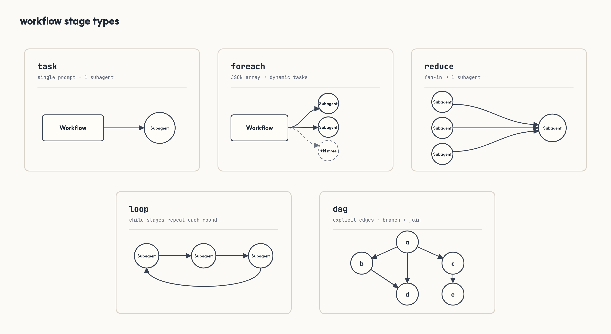
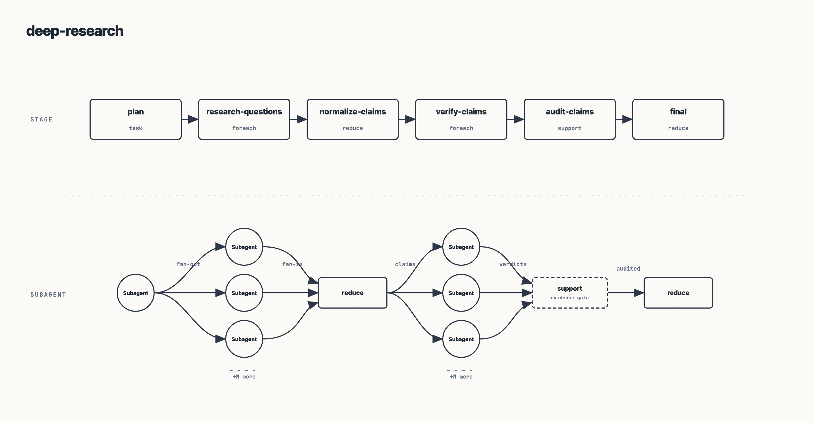
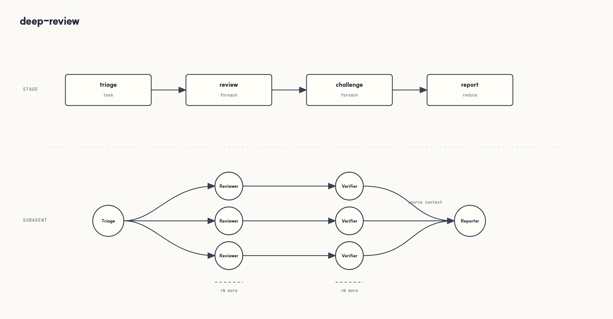

# pi-workflow

**Workflow orchestration for Pi.**

[](https://www.npmjs.com/package/@agwab/pi-workflow)

`pi-workflow` lets Pi run repeatable multi-agent workflows: research, review, implementation loops, test repair, and project-specific team routines.

Public `schemaVersion: 1` workflow specs use `artifactGraph.stages` as the artifact-graph contract.

It is a thin orchestration layer on top of [`@agwab/pi-subagent`](https://www.npmjs.com/package/@agwab/pi-subagent). A workflow defines stages, agents, tools, output contracts, and support helpers. The concrete user task is still supplied at runtime in natural language.

## Installation

Install the package:

```bash
pi install npm:@agwab/pi-workflow
```

Then reload Pi.

This installs both:

- the `/workflow` extension
- the bundled `workflow-guide` skill

To update later:

```bash
pi update npm:@agwab/pi-workflow
```

Requires Node.js `>=22.19.0` on macOS or Linux. Native Windows is not supported; use WSL2.

## Usage: ask naturally

After installation, ask Pi to use a bundled or project workflow by name. Bundled workflows reference common Pi agents such as `scout`, `delegate`, and workflow-specific reviewer/researcher agents; create or install matching agents in your Pi environment before running them.

```text
Use the bundled deep-research workflow to research this repository and summarize the architecture tradeoffs.
```

```text
Use the bundled deep-review workflow to review the current diff from multiple angles.
```

```text
Use the spec-review workflow to compare docs/API_SPEC.md against the implementation and tests.
```

## Usage: create your own workflows

Use the bundled `workflow-guide` skill when you want to create, adapt, or review a workflow definition:

```text
/skill:workflow-guide create a workflow for weekly release readiness.
It should inspect docs, tests, recent changes, package metadata, and produce a final checklist.
Save it as a reusable project workflow.
```

```text
/skill:workflow-guide customize deep-review for frontend accessibility and UX review.
Save it as a reusable project workflow.
```

```text
/skill:workflow-guide create a backend API review workflow.
It should check concurrency, transaction safety, error handling, observability, and test risk.
```

## Workflow architecture

A workflow is a deterministic stage graph for running one runtime task through subagent-backed work and local support rails.

The user supplies the runtime task in natural language. The workflow spec supplies the structure: `artifactGraph.stages`, stage ids, `from`/`after` links, agents, tool ceilings, control artifacts, support helpers, loop bounds, run artifacts, and resume behavior.

`pi-workflow` has three main parts:

1. **Workflow graph** — decides what stages exist and when each stage can run.
2. **Subagent-backed stages** — `task`, `foreach`, `reduce`, and `loop` launch Pi subagents through `@agwab/pi-subagent` (there is no `parallel` stage type; use multiple roots or `after: []`).
3. **Support rails** — workflow artifacts (`control.json`, `analysis.md`, `refs.json`), read ledgers, local support helpers, tool policy, worktrees, logs, and artifacts keep runs structured and reviewable.

Important rule:

> Stage order controls scheduling; `from` controls data flow.

A later plain `task` does not automatically receive prior output. Use `foreach.from`, `reduce.from`, or support `from` when a stage needs upstream control artifacts. Use `after` for order-only dependencies.

Nested `type: "dag"` stages are workflow/control containers, not leaf tasks: they contain child `stages`, may expose one child via `outputFrom`, and let downstream stages depend on the container as a named source.

A small workflow definition looks like this:

```json
{
  "schemaVersion": 1,
  "defaults": {
    "agent": "researcher",
    "readOnly": true,
    "tools": ["read", "grep", "find", "ls"]
  },
  "artifactGraph": {
    "stages": [
      {
        "id": "plan",
        "type": "task",
        "prompt": "Put machine-readable JSON in <control> with an items array."
      },
      {
        "id": "inspect",
        "type": "foreach",
        "from": { "source": "plan", "path": "$.items" },
        "each": { "prompt": "Inspect this item: ${item}" }
      },
      {
        "id": "prepare",
        "type": "support",
        "from": "inspect",
        "sourcePolicy": "partial",
        "support": { "uses": "./helpers/prepare.mjs" }
      },
      {
        "id": "report",
        "type": "reduce",
        "from": ["plan", "prepare"],
        "prompt": "Use upstream workflow artifacts to write the final report."
      }
    ]
  }
}
```

## Supported task patterns

Workflow definitions compose task patterns. In the workflow spec they are stage types; at runtime, most of them map to concrete subagent execution shapes.



| Pattern | Use it for | Runtime shape |
|---|---|---|
| `task` | One focused step | one prompt -> one subagent |
| `foreach` | Dynamic fan-out | JSON array from an upstream control artifact -> one subagent per item |
| `reduce` | Fan-in / synthesis | upstream workflow artifacts -> one synthesis subagent |
| `loop` | Bounded repetition | repeat child stages until a deterministic stop condition |
| `dag` | Nested graph container | child stages lowered to namespaced tasks; selected output exposed downstream |

Support helpers are separate from task patterns: they run local workflow code for deterministic preparation, validation, or post-processing.

## Predefined workflows

The package includes a small starter set. These are practical defaults and authoring examples, not a complete workflow catalog.

| Workflow | Use when |
|---|---|
| `deep-research` | Source-backed research, claim verification, citations, or follow-up suggestions. |
| `deep-review` | Multi-lens review where findings should be challenged before final synthesis. |
| `spec-review` | Read-only comparison of a spec/contract against implementation and tests. |
| `change-impact-review` | Read-only impact review for a proposed or applied change, especially missing tests, docs, release work, compatibility risk, and ship blockers. |
| `deep-execution-review` | Repo-wide ambiguous regression hunt with triage, parallel execution-backed reviewers, synthesis, and an evidence gap loop. |
| `implement-loop` | Iterative implementation in one managed worktree until validation passes and review accepts. |





Most teams should create project-specific workflows as their patterns settle.

## More

- [`docs/usage.md`](./docs/usage.md) — command reference, workflow resolution, run artifacts, authoring rules, and release checks.
- [`workflows/README.md`](./workflows/README.md) — bundled workflow notes.
